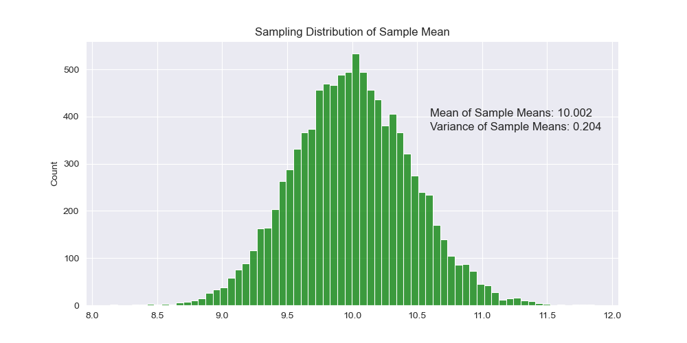

# Statistical Inference

Statistical Inference is the process of drawing general conclusions about the population based on insights gathered from a sample. Often, when studying a population, collecting information from every individual is impractical or impossible. Thus, we rely on analyzing smaller samples to make informed inferences on the entire population. 

The field of Statistics is built on the question:

- How reliable are the conclusions drawn from a sample?

Before we delve into answering the above question, let's go over a few defintions. 

$\large{\textbf{Parameter vs Statistic}}$


- parameter: a number that summarizes entire population data.
- statistic: a number that summarizes sample data.

|          | Parameter | Statistic |
| :---------------- | :------: | ----: |
| Mean       |   $\mu$  | $\overline{x}$ |
| Variance          |   $\sigma^{2}$   | $s^{2}$|
| Standard Deviation   |   $\sigma$  | $s$ |

In other words, we use $\overline{X}$ to estimate $\mu$, $s^{2}$ to estimate $\sigma^{2}$, and so on. 

$\large{\textbf{Example 1}}$

Suppose you were interested in the number of hours Rowan students spendy studying per day. You take a random sample of n=100 students and find the average time they spend studying is $\overline{x} = 3.2$ hours. 

- Population of interest: Rowan students
- Parameter of interest: average time all Rowan students spendy studing per day. 

We use $\overline{x} = 3.2$ as our best of $\mu$. 

Note: $\overline{X}$ is a random variable (unknown until observed) and thus will vary from sample to sample. The randomness in $\overline{X}$ is in how the sample was obtained. The population parameter, however, is generally thought of as a fixed value. 

The variability of the sample mean can be studied usings its sampling distribution. The most famous theorem in the field of Statistics is the $\textbf{Central Limit Theorem}$ which describes the shape of the distribution of $\overline{X}$. CLT is tied to normality and under $\textit{certain conditions}$, $\overline{X}$'s distribution is well approximated by a normal curve.

$\large{\textbf{Central Limit Theorem}}$

The variability of the sample mean can be studied usings its sampling distribution. The most famous theorem in the field of Statistics is the $\textbf{Central Limit Theorem}$ which describes the shape of the distribution of $\overline{X}$. CLT is tied to normality and under $\textit{certain conditions}$, $\overline{X}$'s distribution is well approximated by a normal curve.

Without going into too much of the theory, the CLT essentially states that $\overline{X} \sim N(\mu, \frac{\sigma^{2}}{n})$. 

A general rule of thumb for the CLT to hold is $n \geq 30$. However, it is much more complex than that. In other words, there is no single number that suffices for all applications. If the underlying distribution from which you are sampling is itself normal, then the CLT holds for all sample sizes since the linear combination of indepedent normally distributed random variables is normal. It is reasonable to suggest that the further the population distribution deviates from normality, the larger the sample size required to ensure that the sampling distribution of the mean approaches normality.

$\large{\textbf{Example 2}}$

Suppose you were interested in estimating the mean number of hours Americans watch tv per week. You, as the investigator, go out and randomly sample $n_{1} = 100$ americans and find the sample mean to be $\overline{x_{1}} = 10.4$ hours. Suppose you repeat this process again. That is to say, you randomly sample $n_{2} = 100$ americans and find the sample mean to be $\overline{x_{2}} = 9.5$ hours. If we were to repeat this process, say 10000 times, we would have 10000 estimates of $\mu$ from random samples of the population. 

$\textit{Question: }$ What is the distribution of these 1000 estimates of $\mu$? 

Let's assume that $\mu = 10$. We will simulate random samples using the chi-squared distribution. The expected value of a $\chi^{2}$ distributed random variable is equal to the number of degrees of freedom, which in this case is $10$. The variance is equal to 2*df so in this case $\sigma^{2} = 20$.

```Python
import numpy as np
import matplotlib.pyplot as plt
import seaborn as sns
import scipy.stats as stat

# repeatedly sample from some population, calculate the mean and store it in a list
list_of_means = []
iterations = 10000

for j in range(iterations):
  sample = np.random.chisquare(df=10, size=100)
  sample_mean = np.mean(sample)
  list_of_means.append(sample_mean)

mean_of_all_means = np.round(np.mean(list_of_means), 3)
variance_of_all_means = np.round(np.var(list_of_means), 3)

plt.figure(figsize=(10,5))
sns.set_style('darkgrid')
sns.histplot(list_of_means, color='green')
plt.title(f'Sampling Distribution of Sample Mean')
plt.text(10.6, 400, f'Mean of Sample Means: {mean_of_all_means}', fontsize=12)
plt.text(10.6, 370, f'Variance of Sample Means: {variance_of_all_means}', fontsize=12)
plt.show()
```




In theory, $E[\overline{X}] = 10$ and $Var[\overline{X}] = .2$. The results we simulated match with the theory. 
