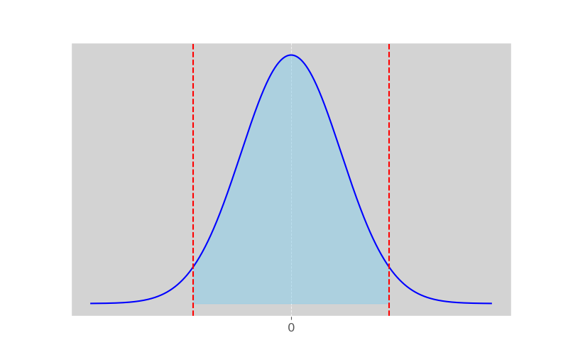

# Confidence Intervals

In a [previous section](https://hamzah-a98.github.io/Statistical%20Inference/Section%201%3A%20statistical_inference/), we learned that $\overline{X}$ is a consistent/trustworthy estimate of $\mu$. If $n$ is "large", CLT provides that 
$$ \bar{X} \sim N(\mu, \frac{\sigma^{2}}{n}) \label{clt} \tag{1}$$

$\textbf{Question}$: How can we take advantage of the Central Limit Theorem to learn more about our parameter of interest, $\mu$? Can we construct a range of values that is **likely** to contain $\mu$? 

Based on our distribution result, we can standardize \eqref{clt}: 

$$ \frac{\overline{X} - \mu}{\sigma/\sqrt{n}} \sim N(0, 1)$$

Here, $Z = \frac{\overline{X} - \mu}{\sigma/\sqrt{n}}$ is a random variable whose distribution does not depend on $\mu$ or $\sigma$. This is referred to as a pivotal quantity. 

Let $P(Z > z_{\frac{\alpha}{2}}) = \frac{\alpha}{2}$ and note: 

\begin{equation}
\begin{aligned}
1 - \alpha &= P(-z_{\frac{\alpha}{2}} < \frac{\overline{X} - \mu}{\sigma/\sqrt{n}} < z_{\frac{\alpha}{2}}) \\
& = P(\overline{X} - z_{\frac{\alpha}{2}}\frac{\sigma}{\sqrt{n}} < \mu < \overline{X} + z_{\frac{\alpha}{2}}\frac{\sigma}{\sqrt{n}}) \\
\end{aligned}
\end{equation}

$\large{\textbf{Case I}}$:

 Let $X_{1},...,X_{n}$ be random sample of size n from a population w/ mean $\mu$ and $\textit{known}$ variance $\sigma^{2}$. A $100(1-\alpha)\%$ Confidence Interval for $\mu$ is given by: 
\[ 
    \overline{X} \pm z_{\frac{\alpha}{2}} \frac{\sigma}{\sqrt{n}}
    \]
where the value of $z_{\frac{\alpha}{2}}$ depends on desired confidence level. 

