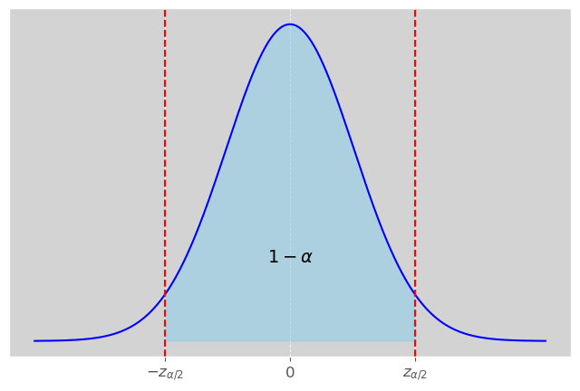
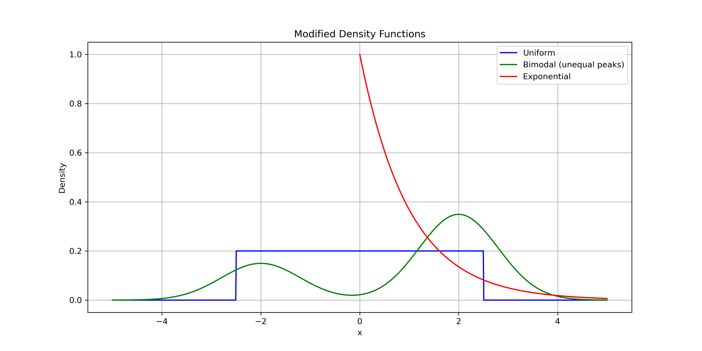
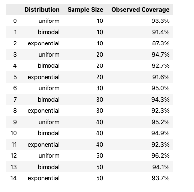
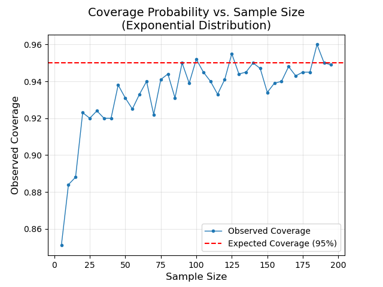
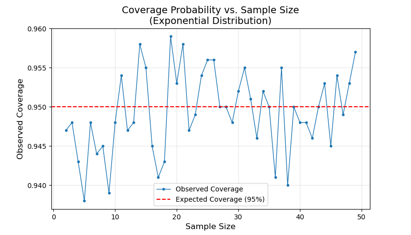

# Confidence Intervals

In a [previous section](https://hamzah-a98.github.io/Statistical%20Inference/Section%201%3A%20statistical_inference/), we learned that $\overline{X}$ is a consistent/trustworthy estimate of $\mu$. If $n$ is "large", CLT provides that 
$$ \bar{X} \sim N(\mu, \frac{\sigma^{2}}{n}) \label{clt} \tag{1}$$

$\textbf{Question}$: How can we take advantage of the Central Limit Theorem to learn more about our parameter of interest, $\mu$? Can we construct a range of values that is **likely** to contain $\mu$? 

Based on our distribution result, we can standardize \eqref{clt}: 

$$ \frac{\overline{X} - \mu}{\sigma/\sqrt{n}} \sim N(0, 1)$$

Here, $Z = \frac{\overline{X} - \mu}{\sigma/\sqrt{n}}$ is a standard normal random variable whose distribution does not depend on $\mu$ or $\sigma$. This is referred to as a pivotal quantity. 

Let $P(Z > z_{\frac{\alpha}{2}}) = \frac{\alpha}{2}$ and note: 

\begin{equation}
\begin{aligned}
1 - \alpha &= P(-z_{\frac{\alpha}{2}} < \frac{\overline{X} - \mu}{\sigma/\sqrt{n}} < z_{\frac{\alpha}{2}}) \\
& = P(\overline{X} - z_{\frac{\alpha}{2}}\frac{\sigma}{\sqrt{n}} < \mu < \overline{X} + z_{\frac{\alpha}{2}}\frac{\sigma}{\sqrt{n}}) \\
\end{aligned}
\end{equation}

$\large{\textbf{Case I (σ is known)}}$:

 Let $X_{1},...,X_{n}$ be random sample of size n from a population w/ mean $\mu$ and $\textit{known}$ variance $\sigma^{2}$. A $100(1-\alpha)\%$ Confidence Interval for $\mu$ is given by: 
\[ 
    \overline{X} \pm z_{\frac{\alpha}{2}} \frac{\sigma}{\sqrt{n}}
    \]
where the value of $z_{\frac{\alpha}{2}}$ depends on desired confidence level. 

| Confidence Level | **$Z_{\frac{\alpha}{2}}$** |
| -------- | ------- |
| 95% | 1.96 |
| 90% | 1.645 |
| 99% | 2.576 |

$\underline{\textbf{Example}}$

In a random sample of 75 Rowan students, the mean height was found to be 67 inches. Assuming the population standard deviation is 7 inches, construct a 95% confidence interval for the mean height of all Rowan students.

<mark>Solution</mark>

We have $\overline{x} = 67$, $\sigma = 7$, $n=75$, $z_{\frac{\alpha}{2}} = 1.96$. Therefore, a 95% CI for $\mu$ is:

\begin{equation}
\begin{aligned}
&       \hspace{3mm} \overline{x} \pm 1.96 \frac{7}{\sqrt{75}} \\
& = (65.4, 68.58) \\
\end{aligned}
\end{equation}

Interpretation: With 95% confidence, we estimate that the mean height of all Rowan students is somewhere between 65.4 and 68.58. 

Note: from the sample we found $\overline{x} = 67$ inches. Using CI, we're saying we're 95% confident that $\mu$ is somewhere between 65.4 and 68.58.

$\textit{Limitation}$ of Z Confidence Interval: $\sigma$ is unlikely to be known. 

$\large{\textbf{Case I (σ is unknown)}}$:

Since $\sigma^{2}$ in unlikely to be known to the practitioner, we are often limited to $s^{2}$. The quantity 
\[ 
    \frac{\overline{X} - \mu}{s/\sqrt{n}}
    \]
does not follow a normal distribution. Rather, it follows a *t-distribution* with $n-1$ degrees of freedom. For smaller sample sizes, the t-distribution has heavier tails than the normal distribution and thus we expect more extreme values. However, as the degrees of freedom approach infinity, the t-distribution converges to the normal distribution. 

<u>**CI when σ is unknown**</u>

Let $X_{1}, ..., X_{n}$ be a random sample from a population with mean $\mu$ and unknown variance $\sigma^{2}$, a $100(1-\alpha)%$ CI for $\mu$ is given by: 
\[ 
    \overline{x} \pm t_{\frac{\alpha}{2}, n-1} \frac{s}{\sqrt{n}}
    \]
where $t_{\frac{\alpha}{2}, n-1}$ depends on both sample size and confidence level.  

$\large{\textbf{CI Coverage}}$

The correct interpretation of a Confidence Interval is as follows: With $100(1-\alpha)\%$ confidence, we estimate that $\mu$ is somewhere between L and U. Using the word $probability$ is not correct when it comes to interpreting these intervals. For example, if $\mu = 73$ and we calculate a $95\%$ confidence interval: (65, 72). There isn't a 95 percent chance that 73 is in the interval! It is a yes/no question. 

Rather, if we were to calculate 100 different $100(1-\alpha)\%$ confidence intervals for $\mu$ using 100 different samples of the sample size from the same population, we would expect $100(1-\alpha)$ of them to contain the parameter $\mu$. 

We will investigate this using the below density functions and a range of different sample sizes. It is safe to say that the greater the deviation of the population distribution from normality, the larger the sample size needed to achieve the desired confidence level.

Here are the results from a simulation where a sample of size $n$ is drawn from each distribution, and a confidence interval is constructed. After constructing the Confidence Interval, we verify whether it contains the parameter $\mu$. This process is repeated $1,000$ times for each sample size and distribution combination, allowing us to compute the coverage percentage. It's important to note that since this is a simulation, the value of $\mu$ is known, which would not typically be the case in real-world scenarios.

{ width="500" height="300" style="display: block; margin: 0 auto" }

Invoking the CLT for smaller samples from non-normal distributions is tricky. As displayed in this simulation, we may very well be advertising a certain confidence level that is not realized. For instance, with a sample size of $n=10$ from an exponential distribution, the coverage percentage is merely $87\%$ though we advertised $95\%$. It is important to recognize that the Central Limit Theorem is based on 'Large Sample' theory, meaning the distribution of $\bar{X}$ is well approximated by a normal distribution for 'large' sample sizes. Below is a helpful visual further investigating the coverage percentage for an exponentially distributed population. 

{ width="500" height="300" style="display: block; margin: 0 auto" }

$\large{\textbf{CI for Smaller Sample Sizes}}$

We observed above that for $n=10$, the coverage probability of our CI for an exponentially distributed population was < $90\%$. Please note the following: 

If $X_{1}, X_{2}, ..., X_{n}$ are $iid$ $exponential(\lambda)$, then $\sum X_{i} \sim Gamma(n, \lambda)$. Thus $\frac{2\bar{X}}{\lambda} \sim Gamma(n, \frac{2}{n})$  is a pivotal quantity since its distribution does not depend on the parameter $\lambda$. It follows that 

\[ 
    1 - \alpha = P(a \leq \frac{2\bar{X}}{\lambda} \leq b)
    \]
where $a, b$ are $Gamma(n, \frac{2}{n})$ critical values such that $P(X < a) = 0.025$ and $P(X > b) = .025$. A $95\%$ CI for $\lambda$ is therefore 

\[
0.95 = P(\frac{2\bar{X}}{b} \leq \lambda \leq \frac{2\bar{X}}{a})
\]

Below are results using this construction. 

{ width="500" height="300" style="display: block; margin: 0 auto" }

We demonstrate its reliability primarily for smaller sample sizes, as these are the cases where invoking the Central Limit Theorem is more uncertain. Two things to note: 

- $Gamma(\alpha, \beta) \rightarrow N(\alpha\beta, \alpha\beta^{2})$ as $\alpha$ -> $\infty$. In our case, $\alpha$ is the sample size. 
- This construction may not be too useful in practice since we likely won't be able to reliably judge the distribution of the population from which we sampled. Especially for small sample sizes. 