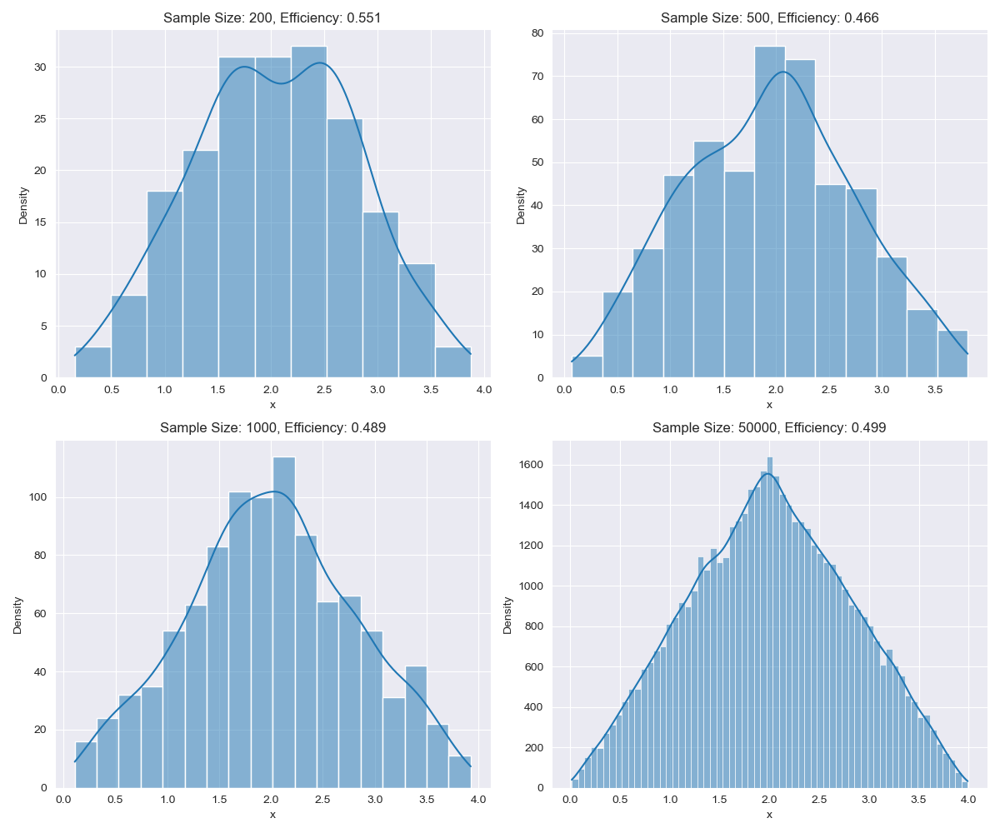

# Sampling Techniques 


### 1. &nbsp; Inverse CDF

**Definition**: Let $Y \sim f_{Y}(y)$ with CDF $F_{Y}(y)$. If $F(y)$ is a valid CDF and is injective, then $y_{i} = F^{-1}(u_{i}) \sim f_{Y}(y)$ where $u_{i} \sim Uniform(0, 1)$

$\underline{\textbf{Example}}$ Suppose we wish to generate $X_{1},..., X_{n} \sim exponential(\beta)$. 

$f(x) = \frac{1}{\beta}e^{-\frac{x}{\beta}}\mathbb{1}_{(0, \infty)}(x)$ and $F_{X}(x) = 1 - e^{-\frac{x}{\beta}}\mathbb{1}_{(0, \infty)}(x)$

Cleary, $F_{X}(x)$ is injective and thus we have $F^{-1}(x) = -\beta ln(1-x)$. 

<mark>Algorithm </mark>

1.  Draw $u_{i} \sim Unif(0, 1)$
2.  Let $x_{i} = F_{X}^{-1}(u_{i})$

Repeat until desired sample size is reached.

```Python
import numpy as np
import matplotlib.pyplot as plt 
import seaborn as sns


def inverse_exp_cdf(u_i, beta):
    return -beta*np.log(1-u_i)[0]

desired_sample_size = 10000

# list to store our simulated samples
samples = []

for iter in range(desired_sample_size):
    u_i = np.random.uniform(0, 1, size=1)
    x_i = inverse_exp_cdf(u_i, beta=1)
    samples.append(x_i)


plt.figure(figsize=(10, 5))
sns.set_style('darkgrid')
sns.histplot(samples)
plt.show()
```


### 2. &nbsp; Accept-Reject

The Inverse-CDF method is limited since it requires the CDF (if it exists) to be invertible. Another method that we can use to generate random samples is the Accept-Reject. Although not sample-efficient, it only requires knowledge of the PDF.

**Definition**: Let $Y \sim f_{Y}(y)$ defined over the interval $(a, b)$ and suppose there exists $h(x)$ that is close to $f(y)$ such that there exists a constant $M \in \mathrm {R^{+}}$ $\ni$ $f(y) \leq Mh(y) \hspace{2mm} \forall \hspace{1mm}y$

In other words, we can obtain samples of $f(y)$ through $h(x)$. 


<mark>Algorithm </mark>

1.  Draw $X \sim Uniform(a, b)$, $Z \sim Uniform(0, M)$
2.  If $z_{i} < f(x_{i})$, accept $x_{i}$. Otherwise reject. 

Note: $M = \displaystyle\max_{y \in (a,b)} f(y)$. 

Below is a helpful visual to understand the acceptance criteria. 


$\underline{\textbf{Example}}$

Suppose we wish to sample from 
\[f(x) = \begin{cases} 
 \frac{x}{4} & \text{if $0 < x < 2$} \\  
 1 - \frac{x}{4} & \text{if $2 \leq x < 4$} \\  
 0 & \text{elsewhere}  
 \end{cases} 
\]

```Python 
import numpy as np
import seaborn as sns
import matplotlib.pyplot as plt

# Our triangular density function
def desired_density(x):
    if 0 < x < 2:
        return x / 4
    if 2 < x < 4:
        return 1 - x / 4
    else:
        return 0


sample_sizes = [200, 500, 1000, 50000]
x_bounds = (0, 4)
x_min, x_max = x_bounds

# Compute M 
x_values = np.linspace(x_min, x_max, 1000)
y_values = [desired_density(x) for x in x_values]
M = np.max(y_values)

# Create subplots
fig, axes = plt.subplots(2, 2, figsize=(12, 10))
axes = axes.flatten()
sns.set_style('darkgrid')
# loop through each sample size and apply the algorithm
for idx, desired_sample_size in enumerate(sample_sizes):
    samples = []
    tries = 0

    # Generate samples
    while len(samples) < desired_sample_size:
        tries += 1
        z_i = np.random.uniform(0, M)
        x_i = np.random.uniform(x_min, x_max)
        if z_i < desired_density(x_i):
            samples.append(x_i)

    # Plot hist
    sns.set_style('darkgrid')
    sns.histplot(samples, kde=True, ax=axes[idx])
    efficiency = desired_sample_size / tries
    axes[idx].set_title(f"Sample Size: {desired_sample_size}, Efficiency: {efficiency:.3f}", fontsize=12)
    axes[idx].set_xlabel("x")
    axes[idx].set_ylabel("Density")


plt.tight_layout()
plt.savefig('accept_reject_sim.png')
plt.show()
```


